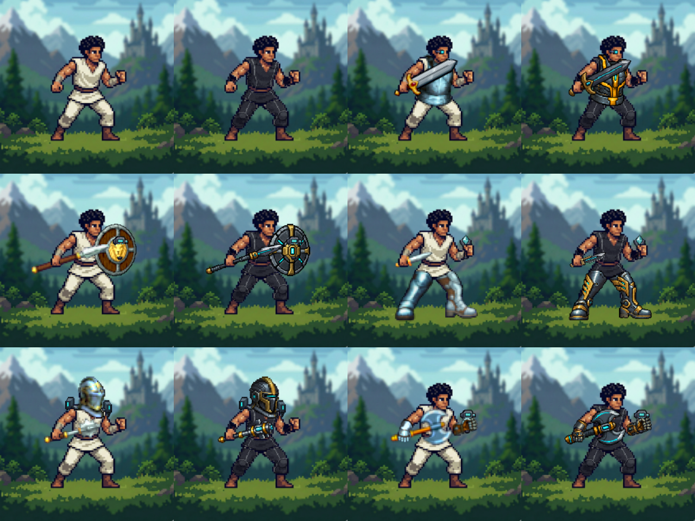
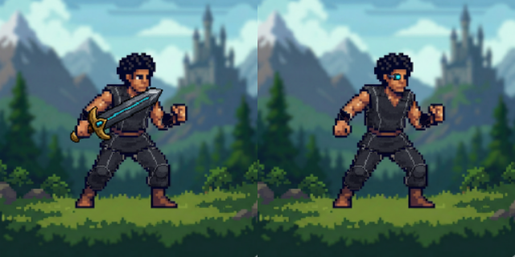

# Operator equipment art — final review

Each adjacent pair is **before (left), after (right)** at the real320px canvas size.
Rows: bare + sword/armor/scope; spear/shield/scanner + dagger/boots/amplifier;
mace/helmet/thruster + axe/gauntlets/scanner. BEFORE images reuse the original
baseline. These are actual React OperatorPreview captures, not mockups.

Minimal weapon-only and utility-only (left/right):

The final17 loadouts include bare, weapon-only, armor-only, utility-only, all five
standard combinations above, all five weapons with gauntlets+scope, shield+thruster,
helmet+scope and armor+thruster. All17 source PNGs loaded at256px; no runtime errors.
See validation.json. Prior source inspection, phone capture and complete five-weapon
sleeve review are retained in ../operator-art-execution-5/.

No art repair was needed in this final integration review. Mappings, gameplay,
inventory and renderer are unchanged. See ../AI-OPERATOR-ART-HANDOFF.md for the
asset-by-asset summary, registration contract and deliberate compromises.

Checks:33 unit tests passed;30 operator e2e tests passed on desktop/Pixel5 (16.6s).
Client/server production build passed using `node --import tsx script/build.ts`;
`npm run build` was blocked by local tsx IPC permission, not a build-code failure.
`npm run check` retains15 existing errors in unchanged production TS. Full e2e is
left to PR CI because it exceeds the local execution timebox.
